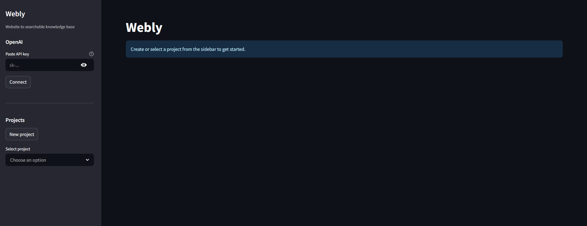
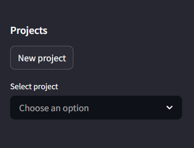
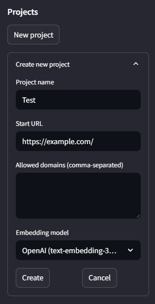
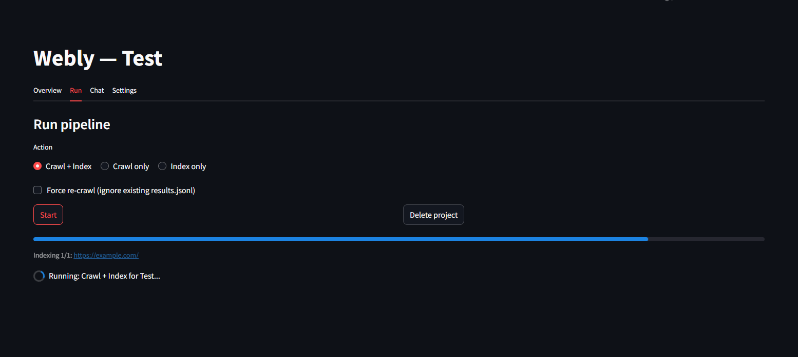
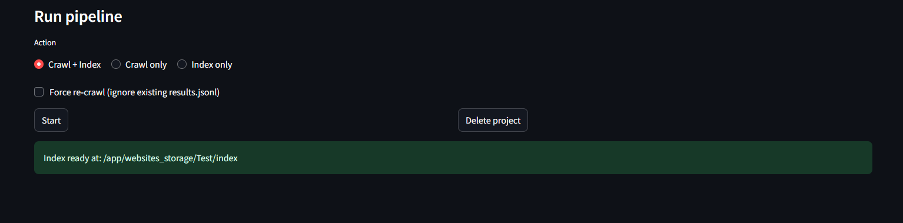
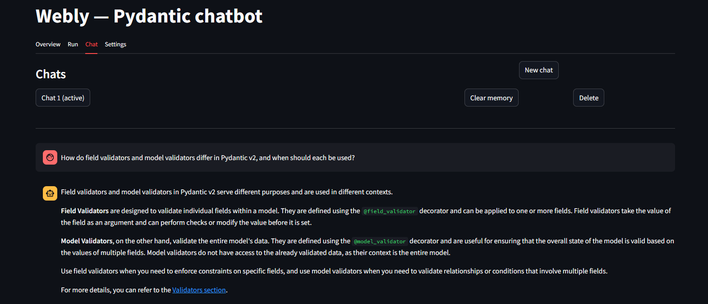
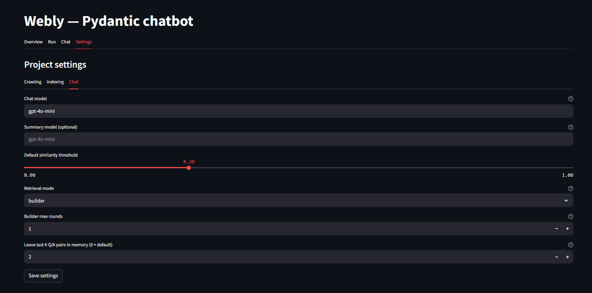

# Webly User Guide (GUI)

This guide is for using Webly through the Streamlit interface.

## 1. Before You Start

You need:
- A running Webly app (`streamlit run app.py` or Docker)
- An OpenAI API key
- A documentation website URL you want to index

Open Webly in your browser:
- `http://localhost:8501`

## 2. Connect Your OpenAI Key

In the sidebar:
1. Find the `OpenAI` section.
2. Paste your API key.
3. Click `Connect`.

If valid, Webly shows `Connected`.

## 3. Create a Project

In the sidebar:
1. Click `New project`.
2. Enter:
- `Project name`
- `Start URL` (example: `https://docs.pydantic.dev/dev/`)
- `Allowed domains` (example: `docs.pydantic.dev`)
3. Pick an embedding model.
4. Click `Create`.

## 4. Crawl and Index Content

Go to the `Run` tab:
1. Choose action:
- `Crawl + Index` (recommended for first run)
- `Crawl only`
- `Index only`
2. Click `Start`.
3. Wait for completion status.

When ready, you should see index/results as ready.

## 5. Ask Questions in Chat

Go to the `Chat` tab:
1. Create or select a chat.
2. Ask documentation-focused questions.

Examples:
- `What is the difference between field validators and model validators?`
- `How does pydantic-settings load environment variables?`

Tip:
- Ask complete, specific questions for better retrieval quality.

## 6. Retrieval Settings (Important)

Go to `Settings` -> `Chat`.

### Retrieval mode
- `builder` (default): concept-aware retrieval with follow-up retrieval rounds.
- `classic`: original retrieval flow.

### Builder max rounds
- How many follow-up retrieval rounds builder mode can run.
- Recommended default: `1` (good quality/cost balance).
- Disabled when mode is `classic`.

### Leave last K Q/A pairs in memory
- Controls how much recent chat memory is used.
- Recommended default: `2`.
- Use `0` to keep default memory behavior.

## 7. Common Troubleshooting

### "No index found"
- Run `Crawl + Index` first in the `Run` tab.

### "Couldn't find relevant information"
- Verify your site was crawled correctly.
- Check `Allowed domains` and crawl filters.
- Re-run crawl/index.

### Wrong or unrelated answer
- Keep questions specific to indexed documentation.
- Use `builder` mode.
- Re-crawl if docs changed.

### Docker shows `0.0.0.0:8501`
- This is expected inside container logs.
- Open from host at `http://localhost:8501`.

## 8. Day-to-Day Workflow

Recommended cycle:
1. Update project settings if needed.
2. Run `Crawl + Index`.
3. Ask questions in `Chat`.
4. If docs changed, re-crawl and re-index.
5. Clear chat memory when switching to a very different topic or just create a new chat.

